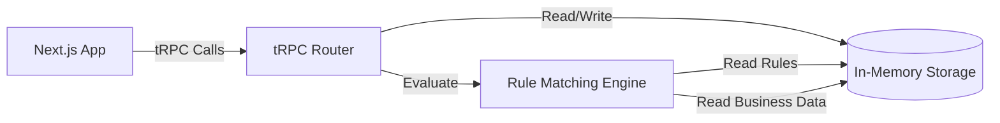

# Business Rule Matching System - MVP Technical Specification

## 1. Overview

A Next.js application that allows users to select from premade business profiles and view applicable rules and regulations. This MVP version uses in-memory storage with tRPC for type-safe API calls and Zod for runtime validation.

**Core Functionality:**
- Business profile selection from sidebar
- Business information display in form-like interface
- Rule matching and display
- Type-safe API with tRPC and Zod

**Key Features:**
- Support for complex rule criteria (AND/OR logic, NOT operators)
- Multi-jurisdiction business support
- Industry-specific rule categorization
- Flexible business attribute modeling
- Real-time rule matching

## 2. Architecture Diagram



**Component Details:**
- **Next.js App**: React frontend with two main pages (business and rules)
- **tRPC Router**: Type-safe API layer with Zod validation
- **In-Memory Storage**: JavaScript objects/arrays holding rules and business data
- **Rule Engine**: TypeScript service for evaluating rule criteria against business profiles

## 3. Configuration

```yaml
# Next.js Configuration
nextjs:
  port: 3000
  apiRoute: "/api/trpc"
  cors:
    origin: http://localhost:3000

# tRPC Configuration
trpc:
  port: 3000
  context: "server"
  transformer: "superjson"

# Rule Engine Configuration
ruleEngine:
  batchSize: 100
  maxCriteriaDepth: 3

# Business Profile Configuration
businessProfile:
  maxLocations: 50
  maxAttributes: 100
  supportedDataTypes: ["string", "number", "boolean", "array", "object"]

# Data Storage Configuration
storage:
  type: "memory"
  persistence: false
  mockDataEnabled: true
```

## 4. API / Protocol

### Zod Schemas

```typescript
import { z } from "zod";

// Core composable schemas
export const AnnualRevenueSchema = z.object({
  amount: z.number(),
  currency: z.string(),
});

export const IndustrySchema = z.object({
  name: z.string(),
  naics: z.string().optional(),
  sic: z.string().optional(),
});

export const LocationSchema = z.object({
  country: z.string(),
  state: z.string().optional(),
  province: z.string().optional(),
  county: z.string().optional(),
  city: z.string().optional(),
  fullName: z.string().optional(),
});

export const ActivitiesSchema = z.object({
  activities: z.array(z.string()),
});

export const ProductsSchema = z.object({
  products: z.array(z.string()),
});

export const BusinessSizeSchema = z.object({
  numEmployees: z.number().optional(),
  sbaSizeStandard: z.enum(['Small Business', 'Large Business']).optional(),
  chainStatus: z.enum(['independent', 'franchise', 'large_chain', 'single_location']).optional(),
});

export const BusinessTypeSchema = z.object({
  businessType: z.enum(['LLC', 'Corporation', 'Partnership', 'Sole Proprietorship']).optional(),
});

export const BusinessFlagsSchema = z.record(z.boolean().optional());

// User schema
export const UserSchema = z.object({
  id: z.string(),
  email: z.string().email(),
  passwordHash: z.string(),
  createdAt: z.date(),
  updatedAt: z.date(),
});

// Core business schema with composable parts
export const BusinessSchema = z.object({
  id: z.string(),
  name: z.string(),
  locations: z.array(LocationSchema),
  
  // Composable schemas - all optional
  revenue: AnnualRevenueSchema.optional(),
  industry: IndustrySchema.optional(),
  activities: ActivitiesSchema.optional(),
  products: ProductsSchema.optional(),
  size: BusinessSizeSchema.optional(),
  type: BusinessTypeSchema.optional(),
  flags: BusinessFlagsSchema.optional(),
  
  // Flexible attributes for anything else
  attributes: z.record(z.any()).optional(),
  
  createdAt: z.date(),
  updatedAt: z.date(),
});

// Rule schema
export const RuleSchema = z.object({
  id: z.string(),
  title: z.string(),
  shortDescription: z.string().optional(),
  fullText: z.string().optional(),
  source: z.string().optional(),
  jurisdiction: z.string().optional(),
  effectiveDate: z.date().optional(),
  retiredDate: z.date().optional(),
  categories: z.array(z.string()),
  criteriaGroups: z.array(CriteriaGroupSchema),
  createdAt: z.date(),
  updatedAt: z.date(),
});

// Criteria group schema
export const CriteriaGroupSchema = z.object({
  id: z.string(),
  operator: z.enum(['AND', 'OR']),
  criteria: z.array(CriterionSchema),
});

// Criterion schema
export const CriterionSchema = z.object({
  id: z.string(),
  key: z.string(),
  operator: z.enum(['=', '!=', 'IN', 'NOT_IN', '>', '>=', '<', '<=', 'CONTAINS', 'NOT_CONTAINS']),
  value: z.any(),
});

// tRPC input schemas
export const GetBusinessInputSchema = z.object({
  id: z.string(),
});

export const GetBusinessRulesInputSchema = z.object({
  businessId: z.string(),
});

export const CreateBusinessInputSchema = z.object({
  name: z.string(),
  attributes: z.record(z.any()),
  locations: z.array(z.string()),
});
```

### In-Memory Storage Structure

```typescript
// Global in-memory storage
const storage = {
  businesses: new Map<string, Business>(),
  rules: new Map<string, Rule>(),
  nextIds: {
    businesses: 1,
    rules: 1,
    criteriaGroups: 1,
    criteria: 1
  }
};
```

### tRPC Router Structure

```typescript
// tRPC router with procedures
export const appRouter = router({
  // Business procedures
  getBusinesses: publicProcedure
    .output(z.array(BusinessSchema))
    .query(() => {
      return Array.from(storage.businesses.values());
    }),
    
  getBusiness: publicProcedure
    .input(GetBusinessInputSchema)
    .output(BusinessSchema)
    .query(({ input }) => {
      const business = storage.businesses.get(input.id);
      if (!business) throw new TRPCError({ code: 'NOT_FOUND' });
      return business;
    }),
    
  // Rule procedures
  getBusinessRules: publicProcedure
    .input(GetBusinessRulesInputSchema)
    .output(z.array(RuleSchema))
    .query(({ input }) => {
      const business = storage.businesses.get(input.businessId);
      if (!business) throw new TRPCError({ code: 'NOT_FOUND' });
      return evaluateRulesForBusiness(business);
    }),
    
  getAllRules: publicProcedure
    .output(z.array(RuleSchema))
    .query(() => {
      return Array.from(storage.rules.values());
    }),
    
  // Admin procedures
  seedMockData: publicProcedure
    .mutation(() => {
      seedMockData();
      return { message: "Mock data seeded successfully" };
    }),
});
```

## 5. Phases & Tasks

### Phase 0: Manual Data Migration
- [ ] Create `/src/data/businesses/` directory for business JSON files
- [ ] Create `/src/data/rules/` directory for rule JSON files
- [ ] Process each business file in `/mock/businesses/` manually:
  - [ ] Extract business information (name, locations, industry, employee count, revenue)
  - [ ] Convert to JSON format and save as `business-name.json` in `/src/data/businesses/`
  - [ ] Extract numbered rules from "Compliance Rules Analysis" section
  - [ ] Convert each rule to JSON format with proper criteria groups
  - [ ] Save rules as `business-name-rules.json` in `/src/data/rules/`
- [ ] Update seeding function to load from JSON files instead of hardcoded data
- [ ] Test with first 5 business files to ensure format works

**Progress: [2/50] Business files processed**
- ✅ AgriSpan Conglomerate (19 rules)
- ✅ Arbor Sky Winery (18 rules)


## 9. Success Criteria

### Functional Requirements
- [ ] Users can select from premade business profiles
- [ ] Business information displays correctly in form-like interface
- [ ] System correctly matches rules to selected business
- [ ] Rules are properly categorized and displayed
- [ ] Support for complex rule criteria (AND/OR/NOT)
- [ ] Multi-jurisdiction business support

### Performance Requirements
- [ ] Rule matching completes within 1 second
- [ ] Page loads within 2 seconds
- [ ] tRPC calls respond within 500ms
- [ ] Smooth navigation between pages

### Quality Requirements
- [ ] Core functionality works without errors
- [ ] User-friendly interface and experience
- [ ] Comprehensive error handling and logging
- [ ] Type-safe API with tRPC and Zod

### Data Structure Principles
- [ ] **Sparse and specific components** - Only include fields that have clear, well-defined purposes
- [ ] **Flexible attributes** - Everything that doesn't fit neatly into specific components goes into `attributes`
- [ ] **Iterative refinement** - Start with specific components, use `attributes` for everything else, then refactor based on actual usage patterns
- [ ] **No hardcoded industry types** - Use industry classification codes (NAICS/SIC) and let `attributes` handle industry-specific data
- [ ] **Composable design** - Business schema is built from smaller, focused component schemas

### Type Safety Requirements
- [ ] **Types are the source of truth** - All data structures must conform to defined TypeScript types
- [ ] If data doesn't fit existing types, types must be updated first before proceeding
- [ ] No workarounds or data manipulation to force data into inadequate type definitions
- [ ] Type definitions must be comprehensive and accurately represent all possible data scenarios
- [ ] Runtime validation (Zod) must match TypeScript type definitions exactly

### Scalability Requirements
- [ ] Support for 100+ rules in memory
- [ ] Support for 50+ business profiles
- [ ] Modular architecture for future database migration
- [ ] Data structures support future rule types

## 10. Mock Data Strategy

### Business Templates
```typescript
const businessTemplates = {
  restaurant: {
    name: "Joe's Restaurant",
    attributes: {
      industry: "restaurant",
      hasKitchen: true,
      servesAlcohol: false,
      seatingCapacity: 50,
      numEmployees: 75
    },
    locations: ["CA", "NY"]
  },
  manufacturing: {
    name: "Acme Manufacturing",
    attributes: {
      industry: "manufacturing",
      numEmployees: 100,
      hasHazardousMaterials: true,
      equipment: ["forklift", "crane", "assembly_line"]
    },
    locations: ["TX", "OH"]
  },
  retail: {
    name: "Downtown Retail Store",
    attributes: {
      industry: "retail",
      numEmployees: 25,
      hasInventory: true,
      squareFootage: 5000
    },
    locations: ["CA", "WA"]
  }
};
```

### Rule Categories
```typescript
const ruleCategories = [
  "Business Formation & Registration",
  "Licensing & Permits",
  "Zoning & Land Use",
  "Insurance Requirements",
  "Hiring & Onboarding Rules",
  "Wage & Hour Laws",
  "Workplace Safety (OSHA, training)",
  "Benefits & Leave",
  "Anti-Discrimination & Accessibility",
  "Tax & Financial Reporting",
  "Recordkeeping Requirements",
  "Consumer Protection & Advertising",
  "Industry Certifications & Standards",
  "Trade Group or Union Rules",
  "Health & Safety (OSHA, food safety, sanitation)",
  "Building Codes & Inspections",
  "Fire & Emergency Preparedness",
  "Environmental Compliance (waste, emissions, packaging)",
  "Federal vs State vs Local",
  "County/City-specific overlays",
  "Special economic zones or districts",
  "Trade Organization Memberships",
  "Collective Bargaining Agreements",
  "Programmatic Compliance (e.g., SBA programs, DBE certification)"
];
```

### Sample Rules
```typescript
const sampleRules = [
  {
    title: "California Restaurant Safety Requirements",
    shortDescription: "Safety requirements for restaurants in California with 50+ employees",
    categories: ["Workplace Safety (OSHA, training)", "Health & Safety (OSHA, food safety, sanitation)"],
    criteriaGroups: [
      {
        operator: "AND",
        criteria: [
          { key: "locations", operator: "CONTAINS", value: "CA" },
          { key: "industry", operator: "=", value: "restaurant" },
          { key: "numEmployees", operator: ">=", value: 50 }
        ]
      }
    ]
  },
  {
    title: "Federal Minimum Wage Requirements",
    shortDescription: "Federal minimum wage requirements for all businesses",
    categories: ["Wage & Hour Laws"],
    criteriaGroups: [
      {
        operator: "AND",
        criteria: [
          { key: "numEmployees", operator: ">=", value: 1 }
        ]
      }
    ]
  }
];
```

## 11. Page Structure

### Business Page (`/business`)
```typescript
// Layout: Sidebar + Main Content
- Sidebar: Business selection list
- Main Content: Business information form
  - Business name (read-only)
  - Attributes section (read-only, form-like display)
  - Locations section (read-only)
  - Navigation to rules page
```

### Rules Page (`/rules`)
```typescript
// Layout: Simple list display
- Header: Selected business name
- Rules list: All applicable rules
  - Rule title
  - Short description
  - Categories
  - Navigation back to business page
``` 