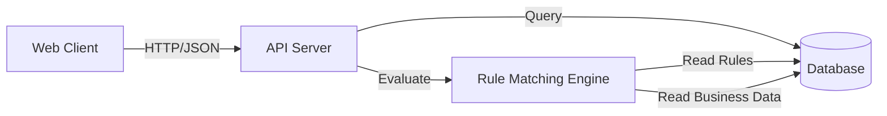

# Business Rule Matching System - Technical Specification

## 1. Overview

A web-based application that allows businesses to input their profile information and receive a comprehensive list of applicable rules and regulations. The system uses a flexible, criteria-based matching engine to determine rule applicability across multiple jurisdictions and industries worldwide.

**Core Functionality:**
- Business profile creation and management
- Flexible rule criteria matching engine
- Categorized rule display
- User account management
- Scalable rule and business data storage

**Key Features:**
- Support for complex rule criteria (AND/OR logic, NOT operators)
- Multi-jurisdiction business support
- Industry-specific rule categorization
- Flexible business attribute modeling
- Real-time rule matching

## 2. Architecture Diagram



**Component Details:**
- **Web Client**: React/Next.js frontend for business profile management and rule display
- **API Server**: Node.js/Express backend handling business CRUD and rule matching
- **Database**: PostgreSQL with JSONB support for flexible data structures
- **Rule Engine**: TypeScript service for evaluating rule criteria against business profiles

## 3. Configuration

```yaml
# Database Configuration
database:
  host: localhost
  port: 5432
  name: business_rules_db
  user: postgres
  password: ${DB_PASSWORD}

# API Configuration
api:
  port: 3000
  cors:
    origin: http://localhost:3001
  rateLimit:
    windowMs: 900000
    max: 100

# Rule Engine Configuration
ruleEngine:
  batchSize: 100
  cacheEnabled: false
  maxCriteriaDepth: 3

# Business Profile Configuration
businessProfile:
  maxLocations: 50
  maxAttributes: 100
  supportedDataTypes: ["string", "number", "boolean", "array", "object"]
```

## 4. API / Protocol

### Database Schema

```sql
-- Users table
users (
  id UUID PRIMARY KEY DEFAULT gen_random_uuid(),
  email VARCHAR(255) UNIQUE NOT NULL,
  password_hash VARCHAR(255) NOT NULL,
  created_at TIMESTAMP DEFAULT NOW(),
  updated_at TIMESTAMP DEFAULT NOW()
);

-- Businesses table
businesses (
  id UUID PRIMARY KEY DEFAULT gen_random_uuid(),
  user_id UUID REFERENCES users(id),
  name VARCHAR(255) NOT NULL,
  attributes JSONB NOT NULL DEFAULT '{}',
  locations JSONB NOT NULL DEFAULT '[]',
  created_at TIMESTAMP DEFAULT NOW(),
  updated_at TIMESTAMP DEFAULT NOW()
);

-- Rules table
rules (
  id UUID PRIMARY KEY DEFAULT gen_random_uuid(),
  title VARCHAR(500) NOT NULL,
  short_description TEXT,
  full_text TEXT,
  source VARCHAR(255),
  jurisdiction VARCHAR(255),
  effective_date DATE,
  retired_date DATE,
  created_at TIMESTAMP DEFAULT NOW(),
  updated_at TIMESTAMP DEFAULT NOW()
);

-- Rule categories (many-to-many)
rule_categories (
  rule_id UUID REFERENCES rules(id),
  category VARCHAR(100),
  PRIMARY KEY (rule_id, category)
);

-- Rule criteria groups
rule_criteria_groups (
  id UUID PRIMARY KEY DEFAULT gen_random_uuid(),
  rule_id UUID REFERENCES rules(id),
  operator VARCHAR(10) CHECK (operator IN ('AND', 'OR'))
);

-- Rule criteria
rule_criteria (
  id UUID PRIMARY KEY DEFAULT gen_random_uuid(),
  group_id UUID REFERENCES rule_criteria_groups(id),
  key VARCHAR(100) NOT NULL,
  operator VARCHAR(20) CHECK (operator IN ('=', '!=', 'IN', 'NOT_IN', '>', '>=', '<', '<=', 'CONTAINS', 'NOT_CONTAINS')),
  value JSONB NOT NULL
);
```

### API Endpoints

| Endpoint | Method | Description | Request Body | Response |
|----------|--------|-------------|--------------|----------|
| `/api/auth/register` | POST | User registration | `{email, password}` | `{user_id, token}` |
| `/api/auth/login` | POST | User login | `{email, password}` | `{user_id, token}` |
| `/api/businesses` | GET | List user's businesses | - | `[{business_objects}]` |
| `/api/businesses` | POST | Create business | `{name, attributes, locations}` | `{business_object}` |
| `/api/businesses/:id` | GET | Get business details | - | `{business_object}` |
| `/api/businesses/:id` | PUT | Update business | `{name, attributes, locations}` | `{business_object}` |
| `/api/businesses/:id/rules` | GET | Get applicable rules | - | `[{rule_objects}]` |
| `/api/rules` | GET | List all rules (admin) | - | `[{rule_objects}]` |
| `/api/rules` | POST | Create rule (admin) | `{title, description, criteria, categories}` | `{rule_object}` |

## 5. Phases & Tasks

### Phase 1: Core Infrastructure
- [ ] Set up PostgreSQL database with initial schema
- [ ] Create Node.js/Express API server
- [ ] Implement user authentication (register/login)
- [ ] Set up React/Next.js frontend
- [ ] Create basic business profile CRUD operations
- [ ] Implement basic rule storage and retrieval

### Phase 2: Rule Matching Engine
- [ ] Implement rule criteria evaluation logic
- [ ] Add support for AND/OR logic in criteria groups
- [ ] Implement NOT operator support
- [ ] Create rule matching service
- [ ] Add business-to-rule matching endpoint
- [ ] Implement basic rule display functionality

### Phase 3: Business Profile Management
- [ ] Create flexible business attribute input forms
- [ ] Implement location management (arrays of locations)
- [ ] Add attribute validation and type checking
- [ ] Create business profile editor interface
- [ ] Implement profile save/load functionality
- [ ] Add business profile templates for common industries

### Phase 4: Rule Management & Categories
- [ ] Implement rule categorization system
- [ ] Create rule management interface (admin)
- [ ] Add rule criteria builder interface
- [ ] Implement rule search and filtering
- [ ] Add rule import/export functionality
- [ ] Create rule validation system

### Phase 5: User Experience & Polish
- [ ] Design and implement rule results display
- [ ] Add rule explanation functionality
- [ ] Implement responsive design
- [ ] Add loading states and error handling
- [ ] Create user onboarding flow
- [ ] Add business profile templates

### Phase 6: Testing & Optimization
- [ ] Create comprehensive test suite
- [ ] Performance testing and optimization
- [ ] Load testing with mock data
- [ ] Security audit and fixes
- [ ] Documentation and deployment preparation

## 6. Testing Strategy

### Unit Testing
- Rule criteria evaluation logic
- Business attribute matching
- API endpoint functionality
- Database operations

### Integration Testing
- End-to-end rule matching workflows
- User authentication flows
- Business profile management
- Rule management operations

### Performance Testing
- Rule matching with 1000+ rules
- Business profile with 50+ attributes
- Concurrent user load testing
- Database query optimization

### Data Validation Testing
- Business attribute type validation
- Rule criteria syntax validation
- Location data format validation
- Category assignment validation

## 7. Monitoring & Metrics

### Key Metrics
- Rule matching response time
- Number of applicable rules per business
- User registration and engagement
- Rule coverage by category and jurisdiction
- System error rates and uptime

### Monitoring Tools
- Application performance monitoring (APM)
- Database query performance tracking
- User session analytics
- Error logging and alerting

## 8. Deployment

### Development Environment
- Local PostgreSQL database
- Node.js development server
- React development server
- Environment variables for configuration

### Production Environment
- PostgreSQL on managed service (AWS RDS/Azure SQL)
- Node.js API on containerized platform
- React frontend on CDN/static hosting
- Environment-specific configuration management

### CI/CD Pipeline
- Automated testing on pull requests
- Staging environment deployment
- Production deployment with rollback capability
- Database migration management

## 9. Success Criteria

### Functional Requirements
- [ ] Users can create and manage business profiles
- [ ] System correctly matches rules to business profiles
- [ ] Rules are properly categorized and displayed
- [ ] Support for complex rule criteria (AND/OR/NOT)
- [ ] Multi-jurisdiction business support
- [ ] Flexible business attribute modeling

### Type Safety Requirements
- [ ] **Types are the source of truth** - All data structures must conform to defined TypeScript types
- [ ] If data doesn't fit existing types, types must be updated first before proceeding
- [ ] No workarounds or data manipulation to force data into inadequate type definitions
- [ ] Type definitions must be comprehensive and accurately represent all possible data scenarios
- [ ] Runtime validation (Zod) must match TypeScript type definitions exactly

### Scalability Requirements
- [ ] Support for 10,000+ rules
- [ ] Support for 1,000+ business profiles
- [ ] Modular architecture for future enhancements
- [ ] Database schema supports future rule types 